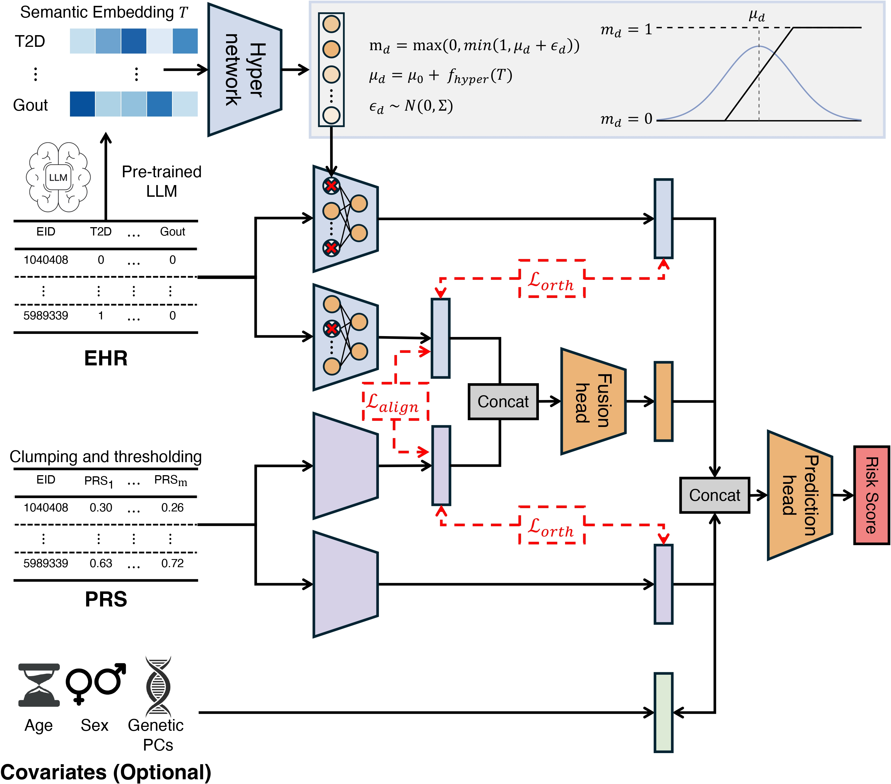

# PEAR

PEAR is an interpretable deep learning method for PRS- and EHR-augmented risk prediction.

This repository contains R scripts for data preparation and Python code for semantic vectors, model fitting, evaluation, and EHR feature gate export.



## Repository structure

1. `data_prepare/`: R scripts for phenotype-specific data preparation and PRS calculation.
2. `functions/`: Python code for semantic vectors, datasets, models, losses, training, and prediction.
3. `reference/`: Phecode definitions and reference table instructions.

## Installation

### Clone the repository

```bash
git clone https://github.com/EddieFua/PEAR.git
cd PEAR
```

### Install Python packages

Use Python 3.10 or newer.

```bash
pip install -r requirements.txt 'transformers>=4.40,<5'
```

Choose a PyTorch build that matches your CPU or CUDA setup.

### Install R packages

```r
install.packages(c(
  "data.table", "bigreadr", "bigsnpr", "bigstatsr", "RcppCNPy", "tidyr"
))
```

## Files prepared for PEAR

All sample-level arrays must share the same sample order. Save numeric arrays as `.npy` files or `.npz` files with an array named `arr_0`.

### Required files

1. PRS matrix `X_prs`: shape `[N, d_prs]`, before scaling.
2. Binary EHR matrix `X_ehr`: shape `[N, d_ehr]`.
3. Label vector `y`: shape `[N]`, with values `0` or `1`.
4. Sample IDs `EID`: length `N`, as a text file with one ID per line or a `.npy` file.
5. Semantic vectors `S_sem`: shape `[d_ehr, d_sem]`, with rows in EHR feature order.

### Optional files

- Covariate matrix `X_cov`: shape `[N, cov_dim]`.
- `semantic.csv`: columns `feature,text`, with one row per EHR feature. Use this table to generate semantic vectors and retain feature names in the outputs.

### Clean UKB data

The scripts in `data_prepare/` prepare UK Biobank inputs for each target phenotype, including PRS calculation. Set the input paths, then run `1_clear_feature.R` followed by `2_compute_prs.R`.

Phecode definitions are included in `reference/`. Supply the ICD-10-to-phecode mapping file described in [reference/README.md](reference/README.md) before running the R scripts. Participant data are not included.

## Quick start

Run the following commands from the repository root.

### Step 1. Create semantic vectors for EHR features

```bash
python functions/semantic_embed_biobert.py \
  --in_csv /path/to/semantic.csv \
  --text_col text \
  --model dmis-lab/biobert-base-cased-v1.1 \
  --batch_size 32 \
  --out_sem /path/to/sem_emb.npy
```

**Output:** `sem_emb.npy` with shape `[d_ehr, 768]`, and `sem_emb.json` with model settings.

### Step 2. Fit PEAR with K-fold cross-validation

```bash
python functions/train.py \
  --prs /path/to/X_prs.npy \
  --ehr /path/to/X_ehr.npy \
  --y /path/to/y.npy \
  --covariates /path/to/X_cov.npy \
  --semantic /path/to/semantic.csv \
  --sem /path/to/sem_emb.npy \
  --EID /path/to/EID.txt \
  --out_dir outputs/pear \
  --epochs 100 \
  --batch_size 4096 \
  --kfolds 5 \
  --seed 1
```

Omit `--covariates` if unavailable. Each fold selects its best model by inner validation ROC-AUC and evaluates it on the outer test fold.

**Outputs**

1. `ehr_feature_semantic.csv`: feature table in the original EHR column order.
2. `fold1_model.pt` to `foldK_model.pt`: selected models and preprocessing state.
3. `fold*_features.csv` and `feature_summary.csv`: EHR feature gates for each fold and their mean across eligible folds.
4. `oof_pred.csv`: out-of-fold predictions with `EID`, `y_true`, `fold`, and `y_prob`.
5. `metrics.json`: pooled and per-fold ROC-AUC and PR-AUC.

## Contact

For questions, open an [issue](https://github.com/EddieFua/PEAR/issues), send an [email](mailto:yinghao.fu@my.cityu.edu.hk), or visit my [personal homepage](https://eddiefua.github.io/).
